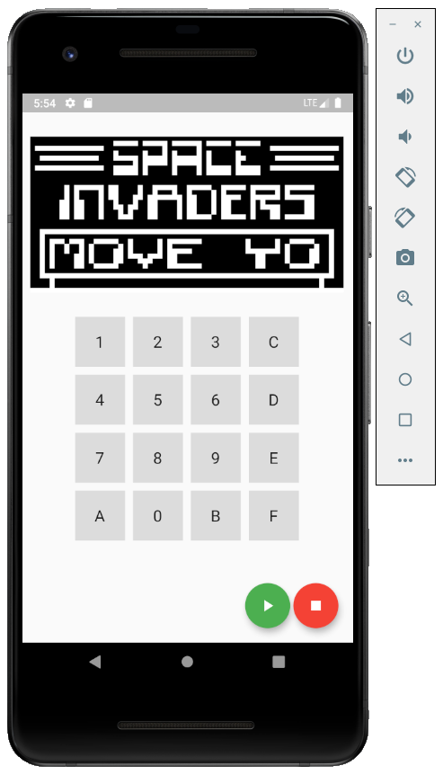

# Chip 8 emulator

Chip 8 emulator written with flutter following the specification from
http://devernay.free.fr/hacks/chip8/C8TECH10.HTM

No sound or super chip instructions will be implemented, cpu fixed at 800Hz

Take a look at the current aspect:

 
